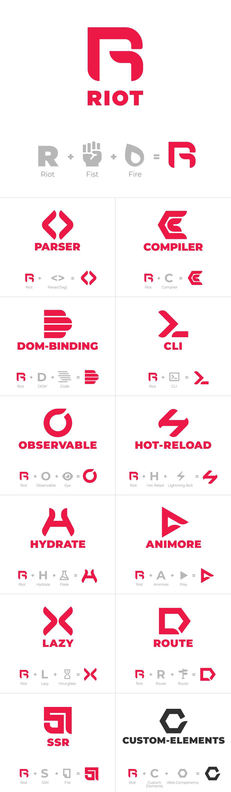

# Branding

Logo and icons for branding Riot.js and its modules.

* [`custom-elements`](https://github.com/riot/custom-elements) module is still highly experimental. Therefore, the color of the logo is black to distinguish its status.

# Credits

[@nibushibu](https://github.com/nibushibu)
